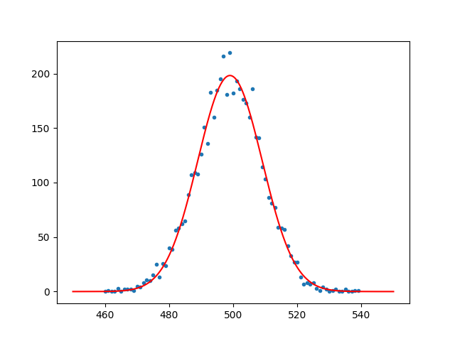

# Part 1: Datalad basics

## Install datalad

Install datalad in which ever way is possible. Look at

```bash
pip3 install datalad-installer
datalad-installer
```

how this is possible the easiest.
On fedora, you can use

```bash
dnf install datalad
```

on Ubuntu, you can use

```bash
apt install git git-annex
pip3 install datalad
```

## Create a new dataset

We have data, that someone produced (maybe it was us, maybe it was one of our collaborators) and we only need to analyse it. Practically, this data is already published as a Datalad dataset, that we will download in just a moment. To speed things up a little, I have already made a python script for you to try and analyse this.

For our analysis, we want to make a new dataset, in which we import the raw data and analyse it with a python script.

```bash
datalad create analysis
cd analysis
```

### Add content

Imagine you already have some kind of script, that you have written. An already prepared example can be downloaded from here:

```bash
wget -O script.py https://raw.githubusercontent.com/jkuhl-uni/datalad-code-along/master/src/files/script.py
```

By downloading it, we have changed something in a DataLad-tracked folder. Analogous to a git-repository, we commit the changes:

```bash
datalad save -m "add analysis script"
```

The analysis script is to be used as

```bash
python3 ./script.py <data-file> <output-file>
```

### Add another dataset

Next, we want to download the data, that we want to analyse:

```bash
datalad install https://github.com/jkuhl-uni/test-data.git
datalad save -m "add data as sub-dataset"
```

### Run the analysis script

Let's try to run it with the first data file:

```bash
python3 ./script.py test-data/data1.out ./plot1.pdf
```

We find that this does not work. This is, since we only have the place-holder files in our installation of the `data` dataset.
we run

```bash
datalad get test-data/data1.out
```

to retrieve the data.
Then we run the script again:

```bash
python3 ./script.py test-data/data1.out ./plot1.pdf
```

Now it works!
We can have a look at the plot. it should look something like this:


we have changed the dataset `analysis`. So datalad should also include these changes:

```bash
datalad save -m "add a first plot"
```

Cool, we have a new file in the dataset. But people won't know, how we did this.

### Use `datalad run` and `datalad rerun`

Instead, we can use `datalad run` to make this more reproducible.

```bash
datalad run -i script.py -i test-data/data2.out -o plot2.pdf -m "add a second plot with datalad run" "python3 ./script.py test-data/data2.out plot2.pdf"
```

Nice, this looks pretty easy.
We can have a look at the history of the repository as usual with `git log [--oneline]`.
Alright. Now imagine we just had a stroke and forgot how the heck we got the second plot. Luckily, we ran this with `datalad run`. To redo the changes applied with this commit, we run

```bash
datalad rerun <last-commit-id>
```

to re-do the plot we just made.
